# OpenStreetMap Data Case Study
**Wrangle OpenStreetMap Data Udacity Project**

**Author: [Arthur Vetori]

**Date: August 9, 2018**

## Map Area
[Manhattan, NY, United States](https://en.wikipedia.org/wiki/Manhattan)

I choose this area because I work in financial markets and this area is the financial center of the United States. One day I wish to go there.
I used mongodb over SQL for learning purposes. I think it would be a good idea to learn mongo.

## Problems Encountered in the Map
After initially downloading a small sample size of the map, I processed it in data.py and inserted in MongoDB to view a bit of the schema. I found out that

1. Some second level “k” tags separated by “.”

```xml
<tag k="cityracks.housenum" v="295"/>
<tag k="cityracks.large" v="0"/>
<tag k="cityracks.rackid" v="2410"/>
<tag k="cityracks.small" v="1"/>
<tag k="cityracks.street" v="Canal St"/>
```

This issue was solved replacing “.” For “:” over the tags

```python
# replace second level tags containing '.' to ':'
def replace_dot(text):
    return text.replace(".",":")
```

2. Second level name tags with multiple languages.

```xml
<tag k="name" v="Mott Street"/>
<tag k="name:en" v="Mott Street"/>
<tag k="name:zh" v="勿街"/>
```

When name is a dictionary instead of string, I consider the name[“en”] element


3. Misplaced value inside second level country tag

```xml
<tag k="tiger:county" v="New York, NY"/>
```

Because we are only analyzing a map inside United States, the country property is not useful.

4. Name abbreviations (ie: St, Ave, etc.)

```xml
<tag k="addr:street" v="E. 54th St."/>
```

In this case, I used a function to replace for the cases found in street names auditing.

```python
mapping = {"St": "Street",
           "St.": "Street",
           "Ave": "Avenue",
           "Ave.": "Avenue",
           "N.": "North",
           "W.": "West",
           "E": "East",
           "E.": "East",
           "Fdr": "Federal",
           "Streer": "Street",
           "Steet": "Street",
           "S": "South",
           "S.": "South",
           "Avene": "Avenue"
           }

# update name abbreviations
def update_name(name):
    for key in mapping:
        newname = re.sub(r'\b' + key + r'\b\.?', mapping[key], name)
    return newname

```


## Overview of the Data

- Map size


- Number of unique users
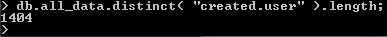

- Number of nodes and ways
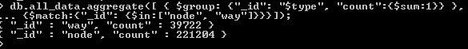

- Top number of amenities appearing in the map.
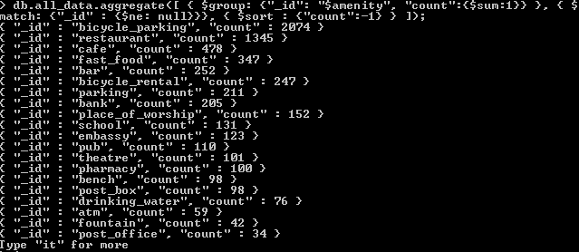


### Additional Ideas

- Top 15 number of streets appearing in result 
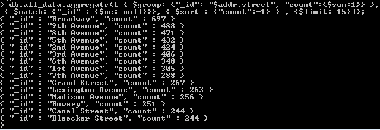

- Top 15 cousine appearing in result
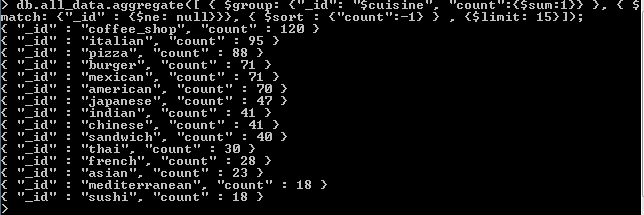

- Top 15 users contribution
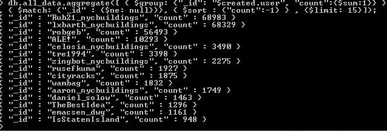

- Top amenity appears as bicycle parking with 30%, followed by restaurant with 19% 


- When looking into schools, we found that there are 131 documents with “amenity”=”school” and Grace Curch School appearing two times.
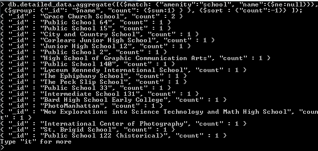

- Grouping by street we found that there are two schools in “East 12th Street” and “East 22nd Street”, with 88 documents that not contain “addr:street” field.
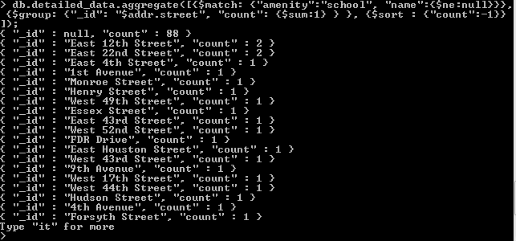

- Chase is the top appearing bank, with 22% of time (44 occurrences)
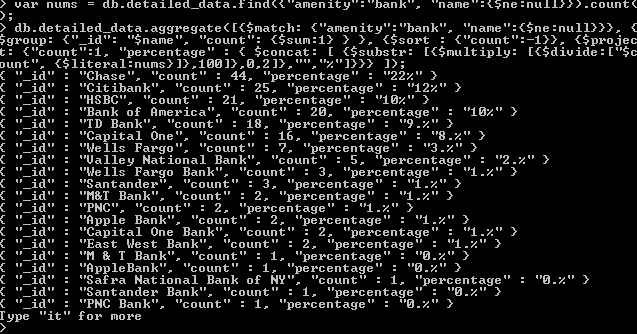

- We have 126 documents with null field in “addr:street” for “amenity”=”bank”. Counted total of 8 banks in 6th Avenue.
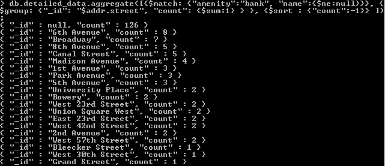

- Banks in 6th Avenue
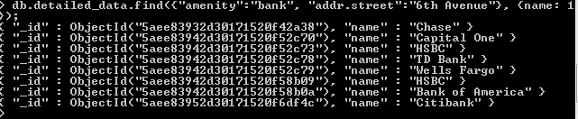

As suggested by the reviewer, it really would be good if there was a rating key on the data, so It could suggest the service quality on the specified amenity. 
This rating could be integrated by something like Foursquare app. 
After running the following command to check for all available fields in the collection we see that there are not any fields that describe the amenity rating 
(thanks to user Kristina @ https://stackoverflow.com/questions/2298870/get-names-of-all-keys-in-the-collection)

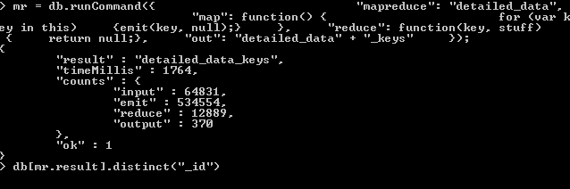

## Conclusion

Although I think that by analyzing a map I could know better the region, the process is more complex than I imagined because of the amount of data contained in the map. 
There are many fields that should be standardized when registering data in the system. I believe this would help us to have a slightly cleaner database.

## References

https://classroom.udacity.com/
https://stackoverflow.com/
https://docs.mongodb.com/
https://wiki.openstreetmap.org/

## Project Structure

- data.py
Its the main script and contains functions for auditing and processing the data

- clean.py
Auxiliar module with cleaning functions

- dbadapter.py
Auxiliar module with database functions, also includes ip, port and database configuration for database.
Change ip, port and database to desired ones.
